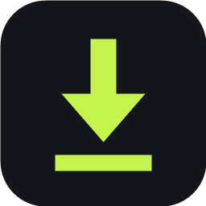
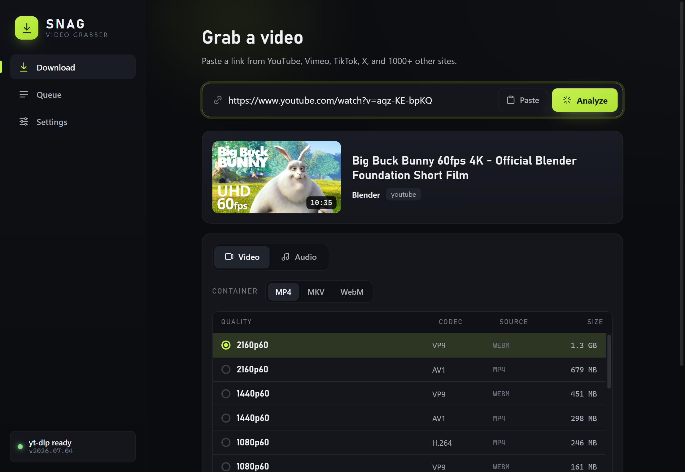
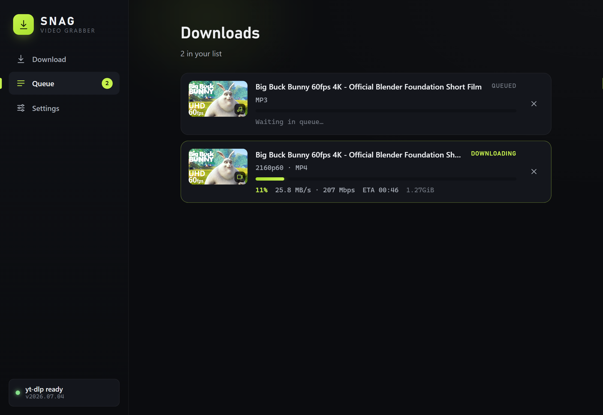
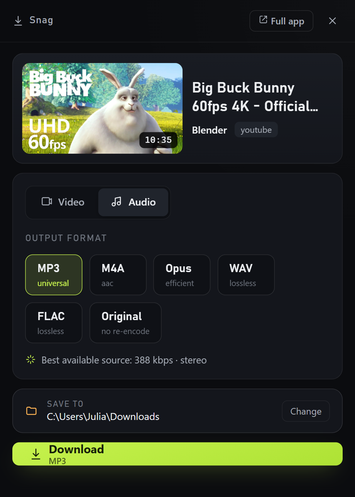
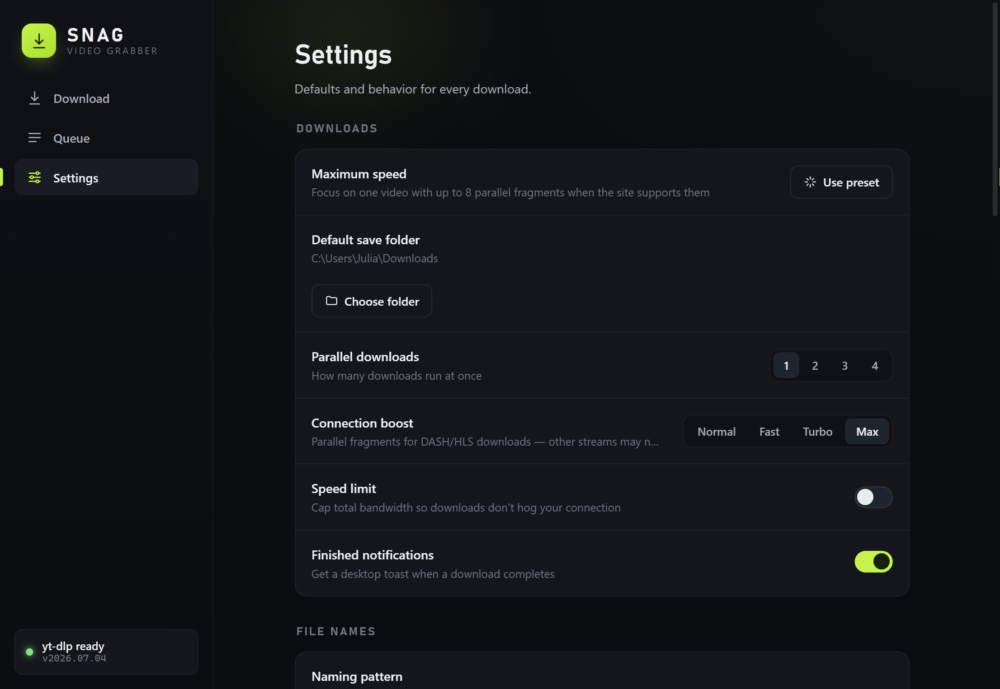

<div align="center">



# Snag

**Paste a link. Pick your quality. Done.**

A fast, beautiful video & audio downloader for Windows — powered by
[yt-dlp](https://github.com/yt-dlp/yt-dlp), works with YouTube and 1000+ other sites.

[](https://github.com/flodisterhoft-ops/snag/releases/latest)
[](https://github.com/flodisterhoft-ops/snag/releases)
[](LICENSE)


[**⬇ Download the latest release**](https://github.com/flodisterhoft-ops/snag/releases/latest)
&nbsp;·&nbsp;
[Browser extension](#-snag-for-chrome)
&nbsp;·&nbsp;
[FAQ](#-faq)

<a href="https://www.buymeacoffee.com/flodisterhoft"></a>

<br/>



</div>

---

## ✨ Why Snag?

- **Best quality in one tap.** A *Best quality* view shows the top resolution in each
  container (MP4/MKV/WebM) side by side with total file sizes, so you can grab the
  smallest 4K — or flip it off for the full table from 4K60 down to 144p with every
  codec. Audio-only as MP3, M4A, Opus, WAV, FLAC.
- **One click from Chrome.** An optional translucent button floats over supported HTML5
  players; click it and an instant quick dialog springs up in the top-right corner —
  kept warm in the tray so there's no "starting up" wait.
- **Fast where the stream supports it.** Up to 16 concurrent DASH/HLS fragments, a
  one-click *Maximum speed* preset (one active download and eight fragments), and live
  speed in MB/s **and** Mbps. Progressive single-file downloads may not get faster.
- **Multi-language audio & subtitles.** Set your languages once and Snag embeds every
  one it finds (like YouTube's dubbed tracks) as switchable audio in a single file, or
  pick a single track per download; plus download or embed captions.
- **Trim before you download.** Pick in and out points in a preview player with
  frame-level nudges and get only that section, cut precisely.
- **Signed-in downloads.** Use your browser's logins (via the Snag extension, Firefox,
  or a cookies.txt) for age-restricted, members-only, and subscriber videos.
- **SponsorBlock.** Cut or chapter-mark sponsors, intros, outros, and more, per category.
- **Playlists and batches.** Grab a single video, a whole playlist into its own folder,
  or paste several links at once.
- **Stays out of your way.** Runs in the tray, queue with pause/resume, drag reordering,
  and retry, toasts with Open and Show in folder buttons, a clipboard watch, and a
  global Ctrl+Shift+D shortcut. yt-dlp keeps itself updated. Dark and light themes.
- **No ads, no accounts, no telemetry.** Analysis and file processing run on your PC.
  Snag still connects to the URL's site to analyze/download media and, when automatic
  update checks are enabled, to GitHub's release API.

<div align="center">

</div>

## 📦 Install

1. Grab the **Setup installer** (recommended — enables the browser handoff) or the
   **portable exe** from the
   [latest release](https://github.com/flodisterhoft-ops/snag/releases/latest).
2. Run it. That's it — **yt-dlp and ffmpeg are bundled**, nothing else to install.

> **Windows SmartScreen may warn you** ("Windows protected your PC") because Snag is a
> free open-source app without a paid code-signing certificate. Click
> **More info → Run anyway**. The source code is all here if you want to check or build
> it yourself.

## 🧩 Snag for Chrome

The companion extension puts Snag one click away on many video sites:

- A **translucent download button** over eligible HTML5 video players
- **Right-click menus** — download this page, this video, or any link
- A **toolbar button** to send the current tab to Snag

Click any of them and the quick dialog appears — video analyzed, quality picker ready:

<div align="center">

</div>

**Install it with one button:** open Snag, and on first launch (or under
**Settings → Browser**) click **Install in Chrome** — Snag prepares the extension, copies its
folder path, and opens your browser's extensions page. Chrome then needs exactly two clicks from
you, because it only auto-installs Web Store extensions:

1. Turn on **Developer mode** (top-right corner of the extensions page).
2. Click **Load unpacked**, paste the path Snag copied for you, and confirm.

Snag's checklist turns green by itself as soon as the extension connects. Reload video tabs that
were already open so Chrome injects the extension. On the first handoff Chrome asks *"Open
Snag?"* — optionally tick **Always allow**.

The overlay is translucent until hovered. It appears only over visible, normal HTML5
`<video>` players at least 250 × 140 pixels and hides in fullscreen. It sends the
**page or iframe URL**, not a `blob:` media source; yt-dlp decides whether that page is
supported. DRM, browser-protected pages, closed shadow-DOM players, sandboxed frames,
and some site CSS can prevent the overlay or the download. The toolbar and right-click
actions remain useful fallbacks.

The extension is copied, not installed from a store, so it does **not** auto-update.
When a Snag release changes the companion extension, click **Refresh extension folder**
in Snag and then **Reload** on its card in `chrome://extensions`. Per-site overlay choices
are stored only in that browser profile, not synced to a Google account.

Works the same in Edge and Brave. Full details in [extension/README.md](extension/README.md).

## ⚙️ Make it yours

<div align="center">

</div>

Default folder and filename pattern, parallel downloads, connection boost, bandwidth cap,
preferred containers/formats, subtitle defaults, tray behavior, quick dialog vs. full app
handoff — plus an optional release checker. It checks GitHub roughly once a day; an app
update opens Snag's GitHub release page, while a yt-dlp update can be applied in place.
Snag does not silently install application updates.

## 🔨 Build from source

```powershell
git clone https://github.com/flodisterhoft-ops/snag.git
cd snag
npm ci                  # install exactly from package-lock.json
npm run dev             # hot-reloading dev app
npm test                # unit tests
npm run typecheck       # TypeScript checks
npm run validate:tools  # validate immutable tool pins and SHA-256 values
npm run dist            # installer + portable exe in ./dist
```

Dev builds can use `yt-dlp`/`ffmpeg` from your PATH. `npm run dist` does **not** copy
arbitrary PATH programs: it downloads the exact Windows x64 releases pinned in
[`TOOLS_MANIFEST.json`](build/tools/TOOLS_MANIFEST.json), verifies every SHA-256 value,
and fails if any byte differs. The resulting package includes both tools and their
license/build notices. Windows **Developer Mode** (or an administrator terminal) may be
needed once so electron-builder can extract its own packaging toolchain.

## ❓ FAQ

**Is this legal?**
Snag is a tool, like a browser's save button. Only download content you have the right to
save — your own uploads, Creative Commons, public domain, or where the creator allows it.
Respect each site's terms of service.

**Why does SmartScreen/my antivirus flag it?**
Snag is unsigned (code-signing certificates cost hundreds of dollars a year). The app is
open source — audit it, build it yourself, or check the release binaries with VirusTotal.

**A video fails to download?**
Sites change constantly; yt-dlp updates almost weekly to keep up. Snag will prompt you
when a yt-dlp update is available — or check via **Settings → Engine → Update**. Snag's
release checker needs GitHub access; an offline check cannot confirm that you are current.

**Where are playlists saved?**
In a subfolder named after the playlist, inside your chosen folder.

**Chrome says the extension folder does not exist, or `snag://` links never open Snag?**
Snag was probably started from inside another app's sandbox — for example from a terminal
embedded in an AI assistant or another Microsoft Store app. Windows then keeps that session's
files in the other app's private folder, which Chrome cannot see. Snag detects this, shows the
folder Chrome can actually open, and offers **Restart Snag normally**; starting Snag from the
Start menu or desktop shortcut fixes it for good and carries your settings over.

**Does it work on Mac/Linux?**
Not yet — Snag is currently Windows-only. The core is Electron, so ports are possible;
open an issue if you're interested.

## ☕ Support

Snag is free and always will be. If it saves you time, a coffee keeps the updates coming:

<a href="https://www.buymeacoffee.com/flodisterhoft"></a>

## 📄 License

Snag's own source is [MIT licensed](LICENSE). Downloads are powered by separate
command-line programs: [yt-dlp](https://github.com/yt-dlp/yt-dlp) and
[FFmpeg](https://ffmpeg.org/). The bundled gyan.dev FFmpeg build is **GPLv3**, not LGPL.
Exact binary/source identifiers, hashes, and notices are in
[`THIRD_PARTY_TOOLS.txt`](build/tools/THIRD_PARTY_TOOLS.txt),
[`TOOLS_MANIFEST.json`](build/tools/TOOLS_MANIFEST.json), and
[`SOURCE_COMPLIANCE.md`](build/tools/SOURCE_COMPLIANCE.md).

If you redistribute Snag's packaged builds, read `SOURCE_COMPLIANCE.md` first: distributing
the GPL FFmpeg executable also requires compliant access to its complete Corresponding
Source, including its statically linked dependencies. The manifest and links identify
the exact build but do not replace that source-distribution obligation.
